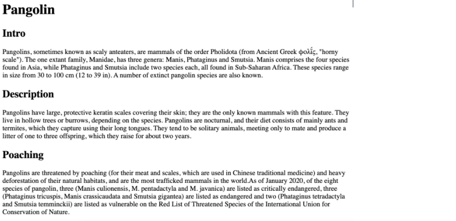

# Class Code
I will update the code written during the class.

# Lab Exercises 
1. Given file - [Pangolin](files/pangolin.html). Format it according to 
2. Given file - [Movies](files/movies.html). Format it according to   
3. Create a wolf.html do the following
   a.Create a link that goes to - [Gray Wolf](https://en.wikipedia.org/wiki/Wolf)
   b. Create an image element using - [Gray Wolf picture](https://en.wikipedia.org/wiki/Wolf#/media/File:Eurasian_wolf_2.jpg) 
