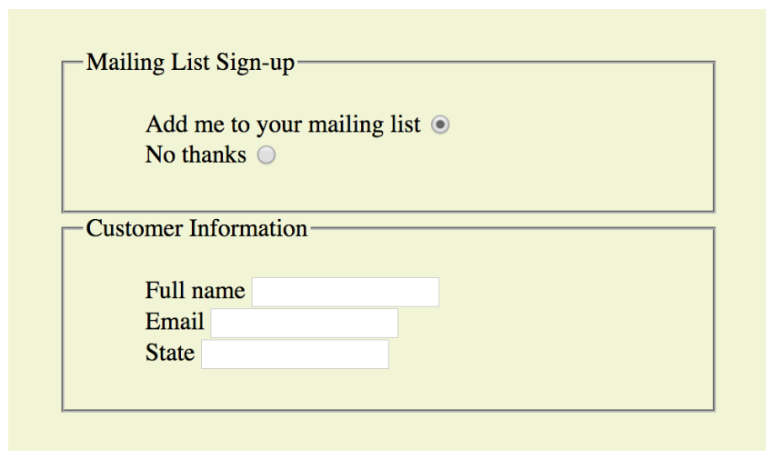

# Class Code
I will update the code written during the class.

# Lab Exercises 
1. Given file - [Pangolin](files/pangolin.html). Format it according to 
2. Given file - [Movies](files/movies.html). Format it according to   
3. Create a wolf.html do the following
   - Create a link that goes to - [Gray Wolf](https://en.wikipedia.org/wiki/Wolf)
   - Create an image element using - [Gray Wolf picture](https://upload.wikimedia.org/wikipedia/commons/6/68/Eurasian_wolf_2.jpg)
4. Using a h1 element recreate the following figure:  
   - Use snowman entity code.
   - Use registered trademark entity code
5. Your goal is to create a table, with proper headings. You should use: table, thead, tr, th, tbody , td 
6. Try to search using Reddit, Google Form & Youtube.
7. Write a simple form with the following inputs:
  - Username
    - Text input
    - Should have placeholder text of ’username’
    - Make sure to properly label the input (using id/for attributes)
  - Password
    - Password input
    - Should have placeholder text of ’password’
    - Make sure to properly label the input (using id/for attributes)
  - Button
    - With the inner text ’Register’
   Add some div or p elements for spacing.
8. Create a form for Race Registeration
    - Race Registeration
    - First Name  Last name
    - Select a Race
      - Fun Run 5K
      - Half Marathon
      - Full Marathon
    - Email    Password
    - Select Age Group - Under 18, 18 - 30, 31 - 50, 50 +
    - Register
9. Create the following table:  
10. Create the following HTML form also add a submit button:   
11. Using HTML character entities Create an HTML document for the following symbols:
    - &#8747; 2y dy
    - A &#8806; B &rArr; B &#8745; C = &Phi;
12. Create a set of HTML reference pages for the subset of HTML elements and attributes selected by your instructor. There should first be a page that contains a (short) list of two hyperlinks: one hyperlink to a page with a table of elements, and the other to a page with a table of attributes. The table of elements should contain two columns: the first listing the elements, and the second listing the attributes that are associated with each element. The attributes should be listed one per table row, and each element name should span the rows containing its attributes. Each element and attribute name in the table should be a hyperlink to a detail page describing that element or attribute. Each detail page should use a dl style list to define the element or attribute (your description can be short - a sentence or two - but it should be accurate). The table of attributes should be similar, except that the attribute names are in the first column and each attribute name will span a set of rows containing element names associated with the attribute. All pages should have meaningful titles, and tables should include meaningful captions.
13. Create an HTML document (web page) that gathers information as part of an online product ordering system. This page will request shipping and billing name and address, credit card information, and contact information (e-mail address and phone number). It should provide a menu from which the type of credit card (from a list of approximately four options) can be selected; the default selection should be "Select a Credit Card". There should also be fields for entering the card number and expiration date. Furthermore, there should be a checkbox, initially checked, that is labeled "Please keep me informed about future product offerings." Finally, provide submit and clear buttons. All form controls should have appropriate name attributes. Use the GET method for form submission, and specify the empty string for the action.
13. Style the given HTML file - [CSS1](files/css1.html)
    - h1s - green text
    - h2s - magenta text
    - paragraphs - white text, black background color
    - Buttons- red text, pink background color
14. Design a logo for a cold drinks company called - 
 Style the given ( [Logo](files/logo.html) ) h1 using the following:
    - uppercase all the letters, without touching the html!
    - set the font-family to be 'monospace'
    - center align the text
    - set the font weight to 100
    - make the text size 40px
    - set spacing between letters to 20px
    - add a wavy plum underline (plum is the color)
15. Without touching any of the starter HTML code ( todos.html)
  list image
   write CSS according to these rules:
 - Give all li elements the text color blue
 - Give all elments with the class of done the text color grey
 - Give the element with the id clear a red background and white text.
							

